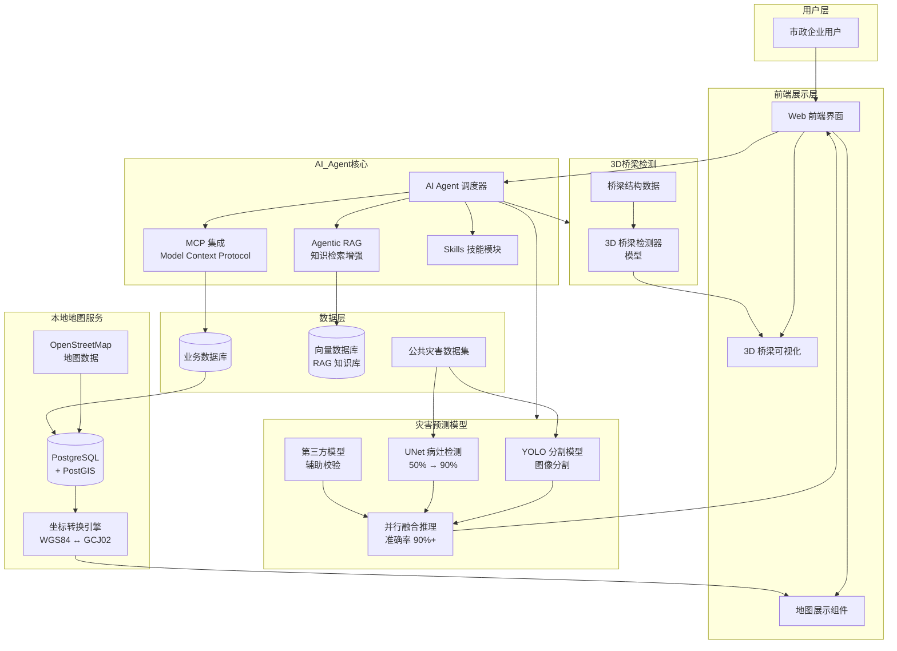
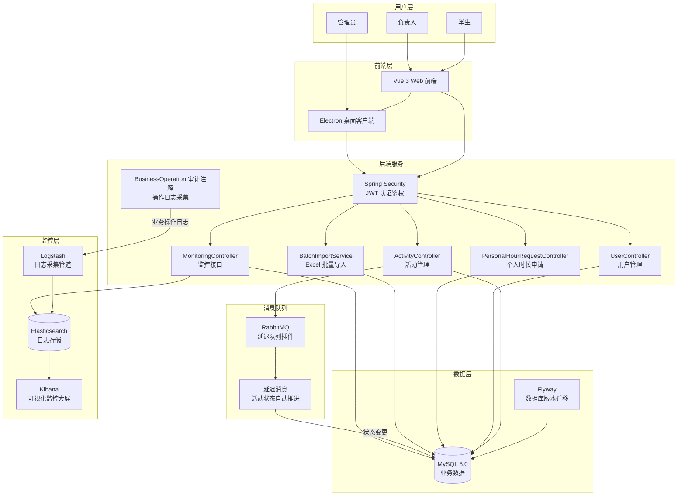
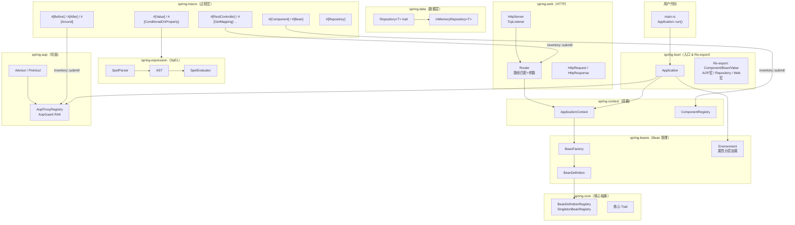
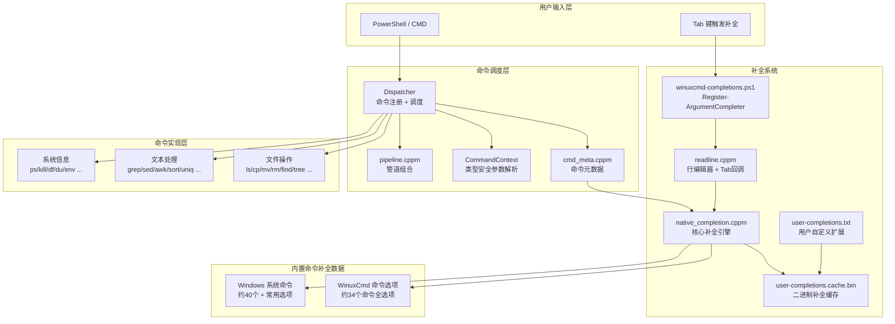

# AI 管养项目

## 背景
- 谁用: 市政企业
- 干什么: 对老系统进行优化,新增AI管养,灾害预测模型训练,地图本地部署,3D桥梁检测器模型搭建
- 已经上线

## 我干了什么

- 项目开始我就作为核心开发开始参与项目,先是和甲方对齐依赖然后和原开发人员对接系统功能
- 之后灾害模型训练交给我处理,使用公共数据集,模型准确率50%(Unet),之后想到yolo模型具备分割能力,然后第三方模型更准确,于是我采取了yolo模型进行分割,然后unet病灶和第三方模型并行的方式将准确率从从50%提升到了90%
- 然后客户说他们想将百度地图sdk修改为自己部署的地图工具,所以我将查询资料,通过openstreetmap的地图数据加PostgreSQL+PostGIS搭建了地图功能,在进行坐标转换后符合客户预期
- 之后AI agent核心开始开发,我参与了Agentic RAG,MCP集成,Skills等核心模块的编写

## 架构图:

# 志愿者管理系统

## 背景
- 谁用：重庆理工大学
- 干什么：对现有志愿者系统手工录入 Excel 表格等低效操作进行自动化管理，支持活动发布、在线报名、时长统计与审核等全流程数字化

## 我干了什么

- 独立负责系统从 0 到 1 的完整开发，覆盖需求分析、架构设计、编码实现到打包部署全流程
- 设计三角色权限体系（学生 / 负责人 / 管理员），使用 Spring Security + JWT Token 实现无状态认证与细粒度接口鉴权
- 设计并实现活动全生命周期管理：活动发布 → 报名开放 → 报名截止 → 活动进行 → 活动结束 → 时长发放，状态驱动业务闭环
- 引入 **RabbitMQ 延迟队列插件**，实现活动状态的定时自动推进，替代原来人工干预的状态变更流程
- 实现 **Excel 批量导入**功能（`BatchImportService` + `ExcelParserService`），将原来手工录入 Excel 的工作量降为零
- 接入 **ELK Stack**（Elasticsearch + Logstash + Kibana），通过自定义 `BusinessOperationLog` 审计注解，将关键业务操作落入 ES，在 Kibana 实现可视化监控大屏
- 使用 **Flyway** 管理数据库版本迁移，保证多环境（开发 / 生产 / Docker Bundle）数据库结构一致
- 开发 **Vue 3 + Vite** 前端，通过 **Electron** 进一步打包为桌面客户端，支持高校离线内网环境下的本地部署
- 提供一键启动脚本（`start.bat`），将 MySQL、RabbitMQ、Elasticsearch、Logstash、Kibana、后端、前端全部整合进离线 Bundle，无需预装任何运行时环境即可部署

## 技术栈

| 层次 | 技术 |
|------|------|
| 后端框架 | Spring Boot 3.3.5、Spring Security、MyBatis |
| 认证 | JWT Token（无状态） |
| 数据库 | MySQL 8.0、Flyway（版本迁移） |
| 消息队列 | RabbitMQ 3.12+（延迟队列插件） |
| 日志监控 | ELK Stack（Elasticsearch + Logstash + Kibana） |
| 前端 | Vue 3、Vite、TypeScript |
| 桌面客户端 | Electron |
| 运行环境 | JDK 17 / 离线 Bundle |

## 架构图

---
# rust-spring

## 背景
- 谁用：Rust 开发者、对 Spring 生态熟悉并希望在 Rust 中复用相同思维模式的工程师
- 干什么：用 Rust 复刻 Java Spring Framework 核心——注解驱动的 IoC 容器、依赖注入、AOP 切面、Spring Boot 风格自动配置、Spring Data 数据层抽象、Spring Web HTTP 服务，完整对标 Java Spring 生态，但只用过程宏注解，不支持 XML 配置
- 技术栈：Rust 2021 Edition、过程宏（proc-macro）、inventory（编译期 bean 注册）、std::net::TcpListener（HTTP 服务）

## 我干了什么

- 从零设计并实现了整个 Cargo Workspace，将 Spring 框架按职责拆分为 10 个独立 crate（spring-core、spring-beans、spring-context、spring-boot、spring-macro、spring-aop、spring-expression、spring-util、spring-data、spring-web），层次清晰、依赖单向
- 实现了 **IoC 容器核心**：`BeanDefinitionRegistry`、`BeanFactory`、`ApplicationContext`，支持 singleton 缓存、prototype 每次创建、懒加载（`#[Lazy]`），完整 bean 生命周期管理
- 编写了 **过程宏套件**（spring-macro）：`#[Component]`、`#[Bean]`、`#[Value]`、`#[Scope]`、`#[Lazy]`、`#[autowired]`、`#[ConditionalOnProperty]`，全部通过 `inventory::submit!` 在链接时注册，无运行时扫描开销
- 实现了 **SpEL 风格表达式引擎**（spring-expression）：手写 Parser → AST → Evaluator 全链路，支持算术/比较/逻辑运算、三元表达式、字符串方法（toUpperCase 等）、`${key:default}` 属性占位符，供 `#[Value("#{...}")]` 注解使用
- 实现了 **AOP 模块**（spring-aop）：`#[Aspect]`、`#[Before]`、`#[After]`、`#[Around]` 注解，基于 `inventory` 静态注册 Advisor，支持 `bean::method` 格式切点表达式，`AopGuard` RAII 结构体驱动 before/after/around 拦截
- 实现了 **环境分层加载**：`application.properties` 基础配置 → `application-{profile}.properties` Profile 覆盖 → `SPRING_PROP_*` 环境变量最高优先级，与 Java Spring 环境抽象一致
- 实现了 **Spring Data 抽象**（spring-data）：`Repository<T>` trait 定义标准 CRUD，`InMemoryRepository<T>` 基于 `RefCell<HashMap>` + 自增主键提供默认实现，`#[Repository]` 宏自动生成委托代码
- 实现了 **Spring Web**（spring-web）：基于 `std::net::TcpListener` 的轻量 HTTP/1.x 服务器，`#[RestController]`、`#[GetMapping]`、`#[PostMapping]` 等路由宏，支持路径参数 `{param}`，IoC 容器 bean 注入请求处理函数
- 编写了 **CLI 脚手架**（initializer）：一条命令生成开箱即用的 spring-boot 项目骨架（Cargo.toml + application.properties + main.rs 演示代码）
- 编写了完整示例（example）和迁移文档（docs/），降低 Java Spring 开发者的上手成本

## 架构图

## 核心注解对照表

| Java Spring | rust-spring | 说明 |
|---|---|---|
| `@Component` | `#[Component]` | 注册为受管 bean |
| `@Autowired` | `#[autowired]` | 字段依赖注入 |
| `@Bean` | `#[Bean]` | 函数式定义 bean |
| `@Value("${k:v}")` | `#[Value("${k:v}")]` | 配置值注入 |
| `@Scope("prototype")` | `#[Scope("prototype")]` | Prototype 作用域 |
| `@Lazy` | `#[Lazy]` | 懒加载 |
| `@Aspect` + `@Before` | `#[Aspect]` + `#[Before]` | AOP 前置通知 |
| `@Around` | `#[Around]` | AOP 环绕通知 |
| `@ConditionalOnProperty` | `#[ConditionalOnProperty]` | 条件注册 |
| `@RestController` | `#[RestController]` | HTTP 控制器 |
| `@GetMapping` | `#[GetMapping]` | GET 路由 |
| `SpringApplication.run()` | `Application::run()` | 应用启动 |

---

# WinuxCmd

## 背景
- 是什么：在 Windows 上原生实现 Linux 常用命令行工具的开源项目，体积仅约 900KB
- 技术栈：C++23、Windows API、CMake、C++ Modules（MSVC）
- 目标用户：在 Windows 开发环境下需要使用 Linux 命令习惯的开发者，以及依赖 Linux 命令输出的 AI 编程工具（GitHub Copilot、Cursor 等）
- 开源地址：https://github.com/caomengxuan666/WinuxCmd

## 我干了什么

### 命令实现（部分参与）

参与了以下共 34 个命令中部分命令的 Windows 原生实现，覆盖文件操作、进程管理、文本处理等类别：

**文件/目录操作类**：`ls`、`cp`、`mv`、`rm`、`mkdir`、`rmdir`、`touch`、`ln`、`chmod`、`pwd`、`realpath`、`tree`、`find`

**文本处理类**：`cat`、`grep`、`head`、`tail`、`wc`、`cut`、`sort`、`uniq`、`tee`、`sed`、`diff`、`xargs`

**系统信息类**：`ps`、`kill`、`df`、`du`、`date`、`env`、`file`、`which`、`echo`

每个命令通过 `CommandContext` 进行类型安全的参数解析，注册到中央 `Dispatcher` 后统一调度，支持管道（pipeline）组合。

### 自动补全系统（独立完整实现）

完整设计并实现了整套 Tab 补全机制，是该项目的核心交互功能之一：

1. **核心补全引擎（`native_completion.cppm`）**
   - 收录 WinuxCmd 自有命令及其全部选项（短选项 / 长选项 + 说明）
   - 内置约 40 个 Windows 系统常用命令（`dir`、`tasklist`、`ipconfig`、`netstat` 等）及高频选项
   - 支持前缀匹配，输入部分字符后按 Tab 即可补全命令名或选项

2. **用户自定义扩展补全**
   - 用户可通过 `%USERPROFILE%\.winuxcmd\completions\user-completions.txt` 添加第三方命令（如 `git`、`docker`）及其选项
   - 支持通过环境变量 `WINUXCMD_COMPLETION_FILE` 指定自定义路径
   - 格式设计为纯文本 pipe 分隔，易于手工编辑，提供 `scripts/user-completions.sample.txt` 模板

3. **补全缓存（`*.cache.bin`）**
   - 用户补全文件首次解析后序列化为二进制缓存
   - 通过比对文件大小 + 最后修改时间决定是否重建，避免每次启动重复解析，实现快速冷启动

4. **PowerShell 集成（`scripts/winuxcmd-completions.ps1`）**
   - 将补全逻辑注册至 PowerShell 的 `Register-ArgumentCompleter`
   - 支持在 PowerShell 7+ / 5.1 环境下原生触发 Tab 补全

5. **交互式 readline（`readline.cppm`）**
   - 实现带历史记录、光标移动、Tab 补全回调的行编辑器
   - 与 `native_completion` 解耦，补全结果以回调方式注入

## 技术亮点

- 使用 C++23 Modules 组织代码，编译期依赖关系清晰，减少头文件污染
- `constexpr_map` 容器实现编译期命令查找表，零运行时开销
- 补全系统与命令实现完全解耦，新增命令只需注册元数据即可自动获得选项补全

## 架构图

